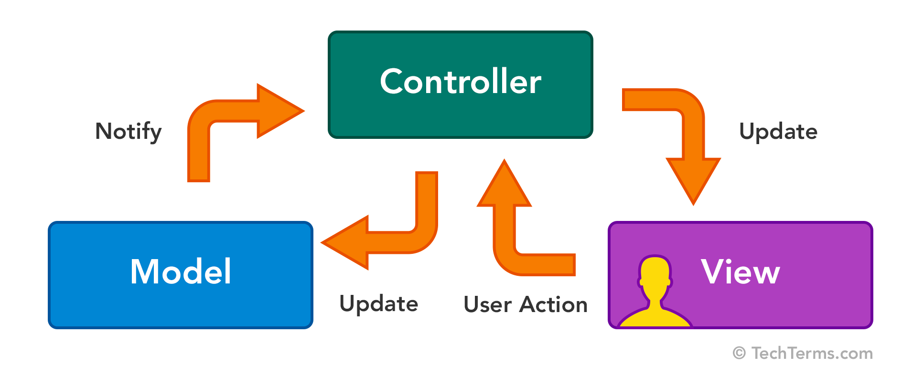

___
# General FAQ
1. **What is RuneDark?**
    - RuneDark is a desktop client for managing automation scripts in games. Unlike traditional injection or reflection frameworks, RuneDark is hands-off, relying solely on computer vision and optical character recognition.
    - *RuneDark does not encourage or support activities that are in violation of any game's Terms of Service.*
2. **Is RuneDark only for OSRS?**
    - RuneDark can be expanded to fit any on-screen computer game.
    - Right now, it only works for 2007-style OSRS interfaces.
3. **Is RuneDark safe?**
    - Although RuneDark is closed source, it is safe and easy to use.
    - The RuneDark team strongly encourages you to scan any executable file you receive for viruses before running it, as this is a best practice for security.
4. **What are the general approaches to gaming software automation?**
    - There are three general types:
        - ***Injection***: Injects unauthorized code into the game, similar to jailbreaking a phone.
        - ***Reflection***: Uses external applications to read game memory and make decisions.
          - ***Example***: If memory at `0x7FFE0300B8C0` drops below 50, a bot could instruct a character to drink a potion.
        - ***Color***: Reads pixel colors on the screen to make decisions without accessing game code.
5. **Why is color botting the safest approach?**
    - Color bots don't alter game code directly; they rely solely on screen visuals, making them harder to detect.
6. **How are injection methods detected?**
    - Game servers inspect data packets for irregularities.
        - **Analogy**: A unique scuff mark on boxes shows authenticity; a missing or altered mark raises suspicion.
7. **How are reflection methods detected?**
    - Servers flag actions that wouldn't be possible through the standard UI.
        - **Example**: A bot detects a potion in the inventory and drinks it even if the inventory tab isn't open, which a human player couldn't do without switching views.
8. **How was RuneDark built?**
    - RuneDark started as a fork from [OSBC](https://github.com/kelltom/OS-Bot-COLOR) 🙏.
    - It was developed and tested on Windows.
9.  **Can I be banned for using RuneDark?**
    - Only if using it irresponsibly in violation of game terms of service.
10. **How likely am I to get banned using RuneDark?**
    - Unlikely if used responsibly. RuneDark's humanization techniques reduce detectability.
11. **Is it safe to bot on my main account?**
    - Caution is advised. Although RuneDark mimics human inputs, no one can game for extended periods (e.g., 20 hours) without breaks.
12. **What actions guarantee a ban?**
    - ***Consistent Input Timing***: e.g., a click every second, down to the microsecond.
    - ***Pixel-perfect Precision***: e.g., perfectly timed cursor movements.
    - ***Rapid Input Sequences***: e.g., thousands of inputs without breaks.
    - ***Instant Reactions***: e.g., dodging instantly after a threat appears.
    - ***Uninterrupted Play***: e.g., playing 24 hours straight.
    - ***Pathing Loops***: e.g., following an exact path every time.
13. **How do game designers detect botting?**
    - Behavioral analysis, memory scans, and network monitoring.
        - ***Behavioral Analysis***: Detects unnatural patterns (precise timing, repetitive actions).
        - ***Memory Scanning***: Finds unauthorized access to in-game data.
        - ***Network Monitoring***: Identifies irregular packet data.
        - ***Machine Learning***: Spots unusual player behavior across datasets.
14. **What anti-botting measures are rumored at Jagex?**
    - Rumored steps include different levels of scrutiny:
        - ***Step 1***: Flags on new accounts can lead to a permanent ban.
        - ***Step 2***: More established accounts receive temporary 2-day bans; repeat offenses lead to permanent bans.
15. **What humanization techniques does RuneDark use?**
    - RuneDark randomizes mouse movements, wait times, and decisions to appear human-like.
16. **How do I avoid bans?**
    - Avoid breaking terms of service, and if using automation, avoid injection or reflection methods.
17. **Does RuneDark run in the background?**
    - No, RuneDark currently requires direct input, though remote input is on the roadmap
___
# Architecture
## Design Pattern
- The core of RuneDark is designed using the Model-View-Controller (MVC) pattern.
- This pattern is used to separate the application's *logic* from its *presentation*. In this app:
  - ***Models*** refer to bots (their properties, functions, etc.).
  - ***Views*** refer to the user interface (the buttons, text, etc.).
  - A ***Controller*** handles communication between these two layers.
<p align="center">
  
</p>

## Core Classes
- `RuneLiteBot`
  - Derived from the base `Bot`, this class contains the general utility functions shared by all bots that interface with RuneLite.
- `RuneLiteWindow`
  - Derived from the base `Window`, this class tailors window references to the idiosyncracies of RuneLite.
- `geometry.RuneLiteObject`
  - This class represents object on the screen, bounded by a `Rectangle`
  - Note that the bounding `Rectangle` for a `RuneLiteObject` is contained within a larger reference `Rectangle` (i.e. the entire screen).
```swift
    (0, 0) ---- Main Monitor Screen Area ------- + ---------------- +
        |                                        |                  |
        |                                        |                  |
        |                                        | top              |
        |                                        |                  |
        |                                        |                  |
        |-----left-- + ----- Rectangle --------- +                  |
        |            |                           |                  |
        |            |                           |                  |
        |            |  + -- RuneLiteObject -- + |                  |
        |            |  |                      | | height           |
        |            |  |                      | |                  |
        |            |  |                      | |                  |
        |            |  + -------------------- + |                  |
        |            + --------- width --------- +                  |
        |                                                           |
        |                                                           |
        + --------------------------------------------------------- +
```
  - Note that this coordinate system is defined with the origin in the upper *left* corner.
  - This is because right-handed click-and-drag operations usually occur from a click in the upper-left corner of the screen that then drags down to the lower-right corner.
___
# Quickstart
1. Install [Python 3.10.9](https://www.python.org/downloads/release/python-3109/).
2. Install [Git Bash for Windows](https://git-scm.com/downloads).
3. Open an IDE (e.g. VS Code).
4. Clone this repository.
5. Set up a virtual environment.
   1. Ensure `virtualenv` is installed: `pip instal virtualenv`
   2. Create a virtual environment: `virtualenv venv --python=python3.10.9`
   3. Activate the newly-created virtual environment: `source venv/Scripts/activate`
   4. Install depedencies: `pip install -r requirements.txt`
6. Run: `python src/rune_dark.py`

❌ If you are getting `ModuleNotFound` errors, *restart* your IDE for the newly-installed modules to be recognized.

## Creating a Bot
- First, check out the existing base template.
- Then, see one of the basic bots and emulate its implementation.

## Testing a Bot Without the UI
- Ensure default settings are hard-coded in the main bot file.
- See the final few lines in `src/rune_dark.py` and change them appropriately.
___
# Packaging
- Compiling builds (i.e. compiling `src/rune_dark.py` into an executable) can be done with these approaches:
  - [Pyinstaller](https://customtkinter.tomschimansky.com/documentation/packaging)
    - This method is not secure, as source code and assets are stored in temp files during execution.
    - Using the [`auto-py-to-exe`](https://pypi.org/project/auto-py-to-exe/) GUI makes this process easier.
  - [Nuitka](https://github.com/Nuitka/Nuitka)
    - This method is far more secure and modern, but build times are significant.
    - The standard command to compile a version of RuneDark is:
      - `python -m nuitka --standalone --follow-imports --enable-plugin=tk-inter --include-module=cv2 --enable-plugin=no-qt src/rune_dark.py`
  - [PyArmor](https://github.com/dashingsoft/pyarmor)
    - A tool used to obfuscate python scripts, bind obfuscated scripts to fixed machine, or expire obfuscated scripts.

- ***Using [Nuitka](https://github.com/Nuitka/Nuitka) and [PyArmor](https://github.com/dashingsoft/pyarmor) together is the best way to compile RuneDark and protect its code through obfuscation.***
1. Make sure both Nuitka and PyArmor are installed:
   1. `pip install nuitka pyarmor`
2. Obfuscate `rune_dark.py` with PyArmor.
   1. Initialize a PyArmor project:
      1. `pyarmor init --src . --entry src/rune_dark.py dist_protected`
         1. This command sets up a PyArmor project with `rune_dark.py` as the entry script and creates a folder named `dist_protected` where the obfuscated files will go.
   2. Obfuscate the files:
      1. `pyarmor pack -x "src/rune_dark.py" --output dist-protected`
         1. This command obfuscates `rune_dark.py` and places the obfuscated code in the `dist_protected` directory.
3. Compile the obfuscated script with Nuitka:
   1. `python -m nuitka --standalone --follow-imports --enable-plugin=tk-inter --enable-plugin=no-qt src/rune_dark.py`
      1. `--standalone` creates a standalone executable that bundles all required dependencies so that the program can run independently of an external Python installation.
      2. `--follow-imports` tells Nuitka to follow all imports in the script and include those modules and their dependencies in the compiled executable.
      3. `--enable-plugin=tk-inter` enables the `tk-inter`  plugin in Nuitka. This includes Tkinter, which is the standard Python GUI library, ensuring Tkinter-dependent code works properly in the compiled executable.
      4. `--enable-plugin=no-qt` enables the `no-qt` plugin in Nuitka, which excludes Qt libraries from the final executable. This can reduce the executable's size, especially if the code doesn't depend on Qt.
      5. `src/rune_dark.py` specifies `rune_dark.py` in the `src` directory as the entry point to be compiled.
4. Test the compiled executable:
   1. `./src/rune_dark.py`
